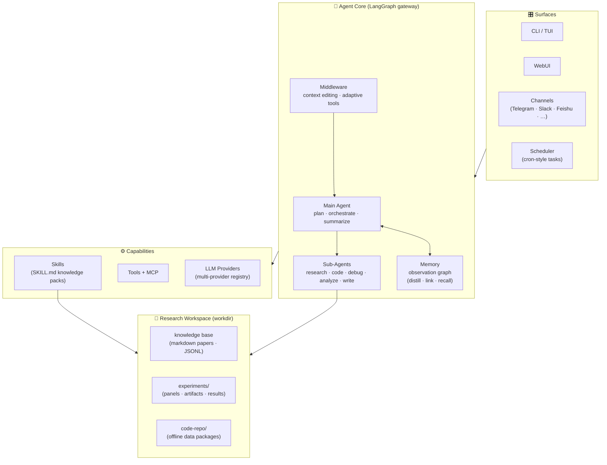
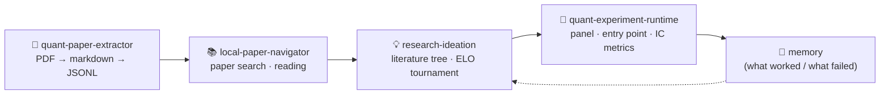

# EvoQuant

**An autonomous research agent for quantitative science.**

EvoQuant is a self-evolving AI research agent specialized in **quantitative investment research**. It runs the full research loop autonomously — digesting research reports into structured knowledge, navigating a local papers library, generating and ranking research ideas, and executing real factor experiments on offline market data with rigorous IC-style evaluation.

Where general-purpose "AI scientist" frameworks target broad academic discovery, EvoQuant is **purpose-built for the quant research workflow**: alpha factor research, alpha generation methodology, and portfolio strategy research, with reproducible experiment runtimes and quantitative metrics (IC / ICIR / RANKIC / coverage) as first-class citizens.

## 🎯 Why EvoQuant?

Most autonomous research agents assume an open ecosystem — public papers with reference implementations on GitHub. Quantitative research rarely works that way: much of the field's methodology lives in broker research reports (研报) — unstructured PDFs that almost never ship with open-source code.

EvoQuant is designed for exactly this gap:

- **📖 Local knowledge extraction** — Research report PDFs dropped into `rawpaper/` become a structured, searchable private knowledge base (`wiki/`): every record carries title / source / strategy / method / experiment / result fields with inline evidence citations, extracted under strict no-fabrication rules.
- **🔧 From-scratch reproduction** — When no reference code exists (the industry norm), EvoQuant reads reports at the L1 *"able-to-reimplement"* depth, re-implements the described method as an executable Research Artifact, and validates it on real offline market data with IC / ICIR / RANKIC metrics — rather than trusting the numbers printed in the PDF.
- **💡 Innovation on top** — Anchor-first ideation: inherit ≥70% of an anchor report's method, contribute a focused ≤30% innovation delta, and let an ELO tournament (Final = Novelty + Relevance + Clarity − Difficulty) decide which ideas are worth running.

## ✨ Features

- **🤖 Multi-Agent Team** — 6 sub-agents (plan, research, code, debug, analyze, write) working in concert.
- **🧠 Self-Evolving Memory** — Observations auto-distilled each turn and self-linked into a knowledge graph that grows across sessions; research cycles feed ideation and experimentation memory.
- **🔬 Quant Research Pipeline** — Report extraction → literature grounding → anchor-first ideation with ELO tournament ranking → experiment execution with IC metrics.
- **📊 Experiment Runtime** — A self-contained executor for "Research Artifacts": offline dataset discovery, panel building, train/val/test splitting, and extensible metric registry.
- **🌐 Multi-Provider** — Anthropic, OpenAI, Google, MiniMax, NVIDIA — one config to switch.
- **📱 Multi-Channel** — CLI/TUI as the hub; Telegram, Slack, Feishu, WeChat, Discord and more — one agent session.
- **🖥️ WebUI** — Workspace-panel web app via `--ui webui`.
- **⏰ Scheduled Tasks** — Cron-style recurring research runs that operate unattended and report back.
- **🔌 MCP & Skills** — Plug in MCP servers or install additional skills from GitHub on the fly.

## 🏗️ Architecture

EvoQuant is built on a [DeepAgents](https://github.com/langchain-ai/deepagents) / [LangGraph](https://github.com/langchain-ai/langgraph) core: a main agent orchestrates specialized sub-agents, middleware and tools around a persistent state graph.



**Key ideas**

| Layer | Role |
|-------|------|
| **Surfaces** (CLI/TUI, WebUI, channels, scheduler) | One agent session, many frontends — all routed through a UI-agnostic LangGraph gateway. |
| **Main agent + sub-agents** | The main agent plans and delegates; sub-agents own focused tasks (literature work, coding, debugging, analysis, writing). |
| **Skills** | Installable knowledge packs (`skills/<name>/SKILL.md` + references/assets/scripts) that give the agent domain procedures — loaded on demand when a query matches. |
| **Memory** | Cross-cycle research memory: feasible/unsuccessful directions, distilled strategies, linked observations. |
| **Research workspace** | A per-cycle workdir holding the local knowledge base, experiment outputs, and the offline `code-repo` data packages the runtime discovers at run time. |

### The quant research loop



1. **Ingest** — `quant-paper-extractor` converts quant research report PDFs into structured JSONL records (strategy, method, experiment, result) for the local knowledge base.
2. **Ground** — `local-paper-navigator` searches the papers library by keyword/abstract/full-text, disambiguates queries, and reads papers with an L1/L2/L3 strategy.
3. **Ideate** — `research-ideation` builds challenge-insight trees, generates anchor-first ideas, refines them in persona-driven tracks, and ranks them with an ELO tournament (Final = Novelty + Relevance + Clarity − Difficulty).
4. **Execute** — `quant-experiment-runtime` discovers offline datasets under `code-repo/`, builds panels, runs a Research Artifact through its Python entry point, and evaluates IC / ICIR / RANKIC / coverage.
5. **Evolve** — outcomes feed persistent memory, so the next cycle starts from what worked and avoids known dead ends.

### 📄 Feeding the knowledge base

The recommended way to use EvoQuant: **place your quant research report PDFs in the workspace's `rawpaper/` directory** before starting a research session.

```text
<workspace>/
  rawpaper/     ← drop research report PDFs here
  markdown/     ← auto-created: full-text markdown per report
  wiki/         ← auto-created: structured JSONL knowledge records
  manifest.jsonl
```

- `quant-paper-extractor` converts the corpus incrementally (`rawpaper/*.pdf` → `markdown/` → `wiki/*.jsonl`), tracked by `manifest.jsonl` — re-running only processes new files.
- This local papers library is the **primary knowledge source of the autonomous research loop**: `research-ideation` grounds every idea in reports retrieved from it via `local-paper-navigator` — by design, generic web search is never used to find papers.

## 📦 Skills

All skills live under [`EvoQuant/skills/`](./EvoQuant/skills/) and are self-contained (`SKILL.md` + `references/` + `assets/` + `scripts/`).

### Quant Research Core

| Skill | Description |
|-------|-------------|
| [`quant-paper-extractor`](./EvoQuant/skills/quant-paper-extractor/) | Convert quant research report PDFs to markdown and structured JSONL records |
| [`local-paper-navigator`](./EvoQuant/skills/local-paper-navigator/) | Search and read papers from a local papers library with ranked retrieval |
| [`research-ideation`](./EvoQuant/skills/research-ideation/) | Quant-focused ideation: scope selection → literature grounding → ELO-ranked proposals |
| [`quant-experiment-runtime`](./EvoQuant/skills/quant-experiment-runtime/) | Experiment executor: dataset discovery, panel build, IC/ICIR/RANKIC evaluation |
| [`research-survey`](./EvoQuant/skills/research-survey/) | Structured literature survey synthesis from collected papers |
| [`paper-graph`](./EvoQuant/skills/paper-graph/) | Genealogical lineage map of a research field as Mermaid diagrams |

### Research Workflow

| Skill | Description |
|-------|-------------|
| [`experiment-pipeline`](./EvoQuant/skills/experiment-pipeline/) | Structured 4-stage experiment execution with attempt budgets |
| [`experiment-craft`](./EvoQuant/skills/experiment-craft/) | Experiment debugging, logging and iteration |
| [`experiment-iterative-coder`](./EvoQuant/skills/experiment-iterative-coder/) | Iterative code refinement (plan → code → evaluate → refine) |
| [`paper-planning`](./EvoQuant/skills/paper-planning/) | Research paper planning and outline generation |
| [`paper-writing`](./EvoQuant/skills/paper-writing/) | Section-by-section paper drafting |
| [`paper-review`](./EvoQuant/skills/paper-review/) | Adversarial self-review before submission |
| [`paper-rebuttal`](./EvoQuant/skills/paper-rebuttal/) | Rebuttal writing after peer review |
| [`academic-slides`](./EvoQuant/skills/academic-slides/) | Academic presentation and research talk creation |
| [`evo-memory`](./EvoQuant/skills/evo-memory/) | Persistent research memory and self-evolution |
| [`evomath-tao`](./EvoQuant/skills/evomath-tao/) | Rigorous proof and grading workflow for mathematical claims |

### Productivity & Tooling

| Skill | Description |
|-------|-------------|
| [`paper-figures`](./EvoQuant/skills/paper-figures/) | Publication-ready matplotlib figures |
| [`nano-banana`](./EvoQuant/skills/nano-banana/) | AI-generated slides and illustrations via Gemini image generation |
| [`find-skills`](./EvoQuant/skills/find-skills/) | Discover agent skills from the open ecosystem |
| [`skill-creator`](./EvoQuant/skills/skill-creator/) | Create, improve and evaluate skills |

## 📦 Installation

> Requires **Python 3.11+** (< 3.14). We recommend [**uv**](https://docs.astral.sh/uv/).

```bash
# Install uv (if you don't have it)
curl -LsSf https://astral.sh/uv/install.sh | sh

# Clone and run from source
git clone https://github.com/CamusGIT/EvoQuant.git
cd EvoQuant
uv sync
uv run evoquant
```

Or install as a tool from git:

```bash
uv tool install "git+https://github.com/CamusGIT/EvoQuant"
evoquant
```

<details>
<summary>🐳 Docker</summary>

```bash
docker compose up
```

</details>

## 🔑 Configuration

```bash
cp .env.example .env
```

Pick one LLM provider and fill in your key (Anthropic, OpenAI, Google, MiniMax, NVIDIA, OpenRouter, …). See `.env.example` for all options, including optional web search and channel credentials.

## ⚡ Quick Start

```bash
uv run evoquant
```

Then, in a session:

```text
"Extract the PDFs in rawpaper/ into my knowledge base."     # quant-paper-extractor
"Find papers about cross-sectional momentum."                # local-paper-navigator
"I want a research direction in alpha factor research."      # research-ideation
"Run the proposed factor on the offline dataset and report IC/ICIR."  # quant-experiment-runtime
```

Skills load automatically when your request matches their descriptions. Install more with `/install-skill`, browse with the skill browser, or ask the agent directly.

## 🗺️ Roadmap

- [x] Quant research pipeline: extraction → navigation → ideation → experiment runtime
- [x] Multi-agent core with self-evolving memory
- [x] Multi-channel surfaces (CLI/TUI, WebUI, Telegram, Slack, Feishu, …)
- [ ] Portfolio strategy metrics (portfolio research objects in the experiment runtime)
- [ ] Alpha generation methodology (`run_batch` evolution loops)
- [ ] Backtest-to-live bridge with execution constraints

## 🤝 Contributing

Contributions are welcome — see [CONTRIBUTING.md](./CONTRIBUTING.md). The fastest way to extend EvoQuant is usually a new skill; see [EvoQuant/skills/README.md](./EvoQuant/skills/README.md) for the skill anatomy and authoring guide.

## 📜 License

This project is licensed under the **Apache License 2.0** — see [LICENSE](./LICENSE).

## 🙏 Acknowledgments

EvoQuant was built with reference to **[EvoScientist](https://github.com/EvoScientist/EvoScientist)** — an open-source multi-agent evolving AI scientist framework for end-to-end scientific discovery. EvoQuant reuses its agent core architecture (DeepAgents/LangGraph multi-agent runtime, memory, channels and skill system) and extends it into a domain-specific platform for autonomous quantitative research, with a rewritten skill suite for the quant research pipeline.

We thank the EvoScientist team for open-sourcing their work. The companion skill repository **[EvoSkills](https://github.com/EvoScientist/EvoSkills)** informed the design of several research-workflow skills included here.

If you use EvoScientist in your work, please cite the original project:

```bibtex
@article{evoscientist2026,
  title={EvoScientist: Towards Multi-Agent Evolving AI Scientists for End-to-End Scientific Discovery},
  author={Lyu, Yougang and Zhang, Xi and Yi, Xinhao and Zhao, Yuyue and Guo, Shuyu and Hu, Wenxiang and Piotrowski, Jan and Kaliski, Jakub and Urbani, Jacopo and Meng, Zaiqiao and Zhou, Lun and Yan, Xiaohui},
  journal={arXiv preprint arXiv:2603.08127},
  year={2026}
}
```
